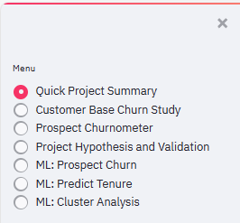
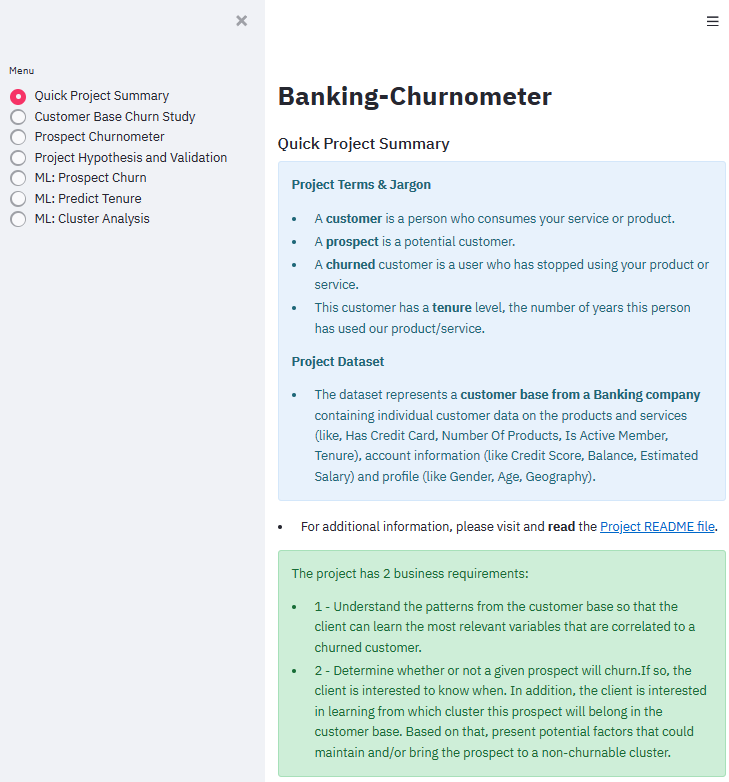
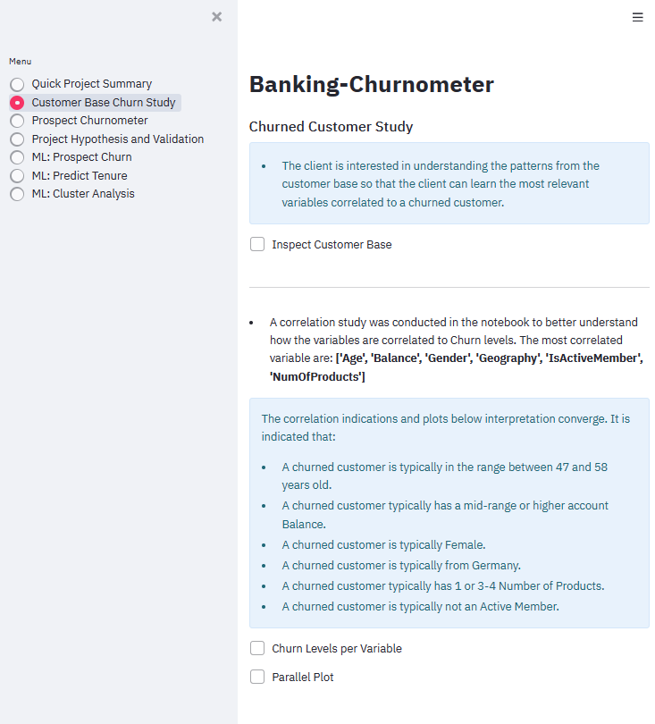
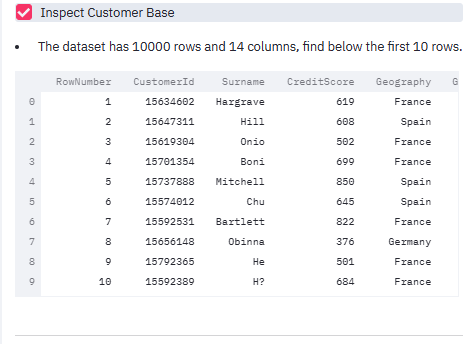
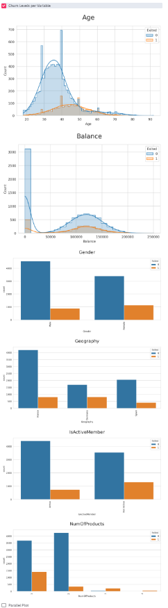
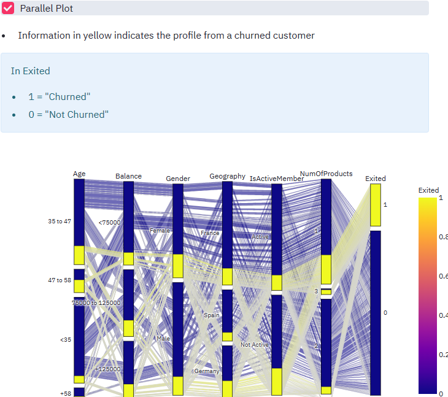
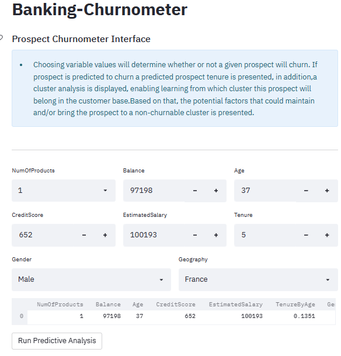
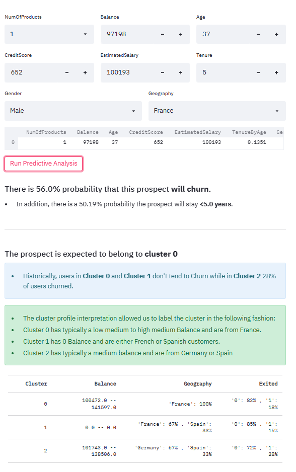
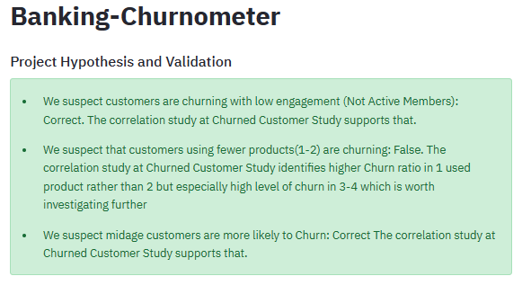
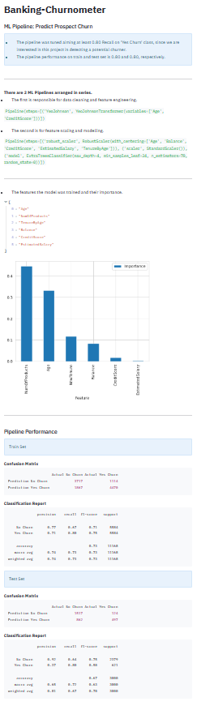

## App Design Images
- Streamlit technology was chosen as it suits the purpose of integrating ML-models with responsive design and UI.

# Menu
    Menu allowing the client to get an overview and easily navigate between the app content pages. Included in all pages.

# Quick Project Summary Page
    Project Terms and Jargon and Business Requirements

# Customer Base Churn Study Page
    Gives the Client an overview and an opportunity to deepdive in the correlation between variables and churn through activating the Widgets for Inspect Customer Base, Churn Levels per Variable and Parallell Plot.

# Prospect Churnometer Page
    Interface that allows the CLient to create a Prospect and run the Predictive Analysis predicting risk of Churn.

    
    When run predict Churn, predict Tenure and Cluster analysis will be presented. Expected to be comprenhensible for non technical users.

# Hypothesis and Validation Page
    Project Hypothesis and validation statements so Client can get a quick read of the main learnings.

# Predict Tenure Pipeline And Performance Page
    Pipeline with Feature Engineering, Selection and ML-model details for Technical Users for replication, evaluation, and future performance enhancement. Also included is a table of the models performance on both train and test set to prove Business Requirements are met.
